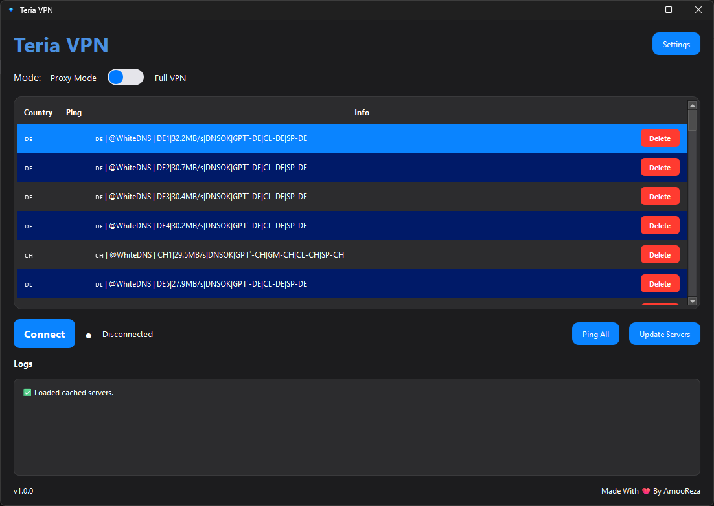

# WhiteDNS VPN

A modern, sleek VPN client for Windows with **Proxy Mode** and **Full VPN (TUN)** support, powered by [Xray core](https://github.com/XTLS/Xray-core).

  

## ✨ Features

- 🔒 **VLESS subscription** – hidden default link, update servers with one click  
- 🧦 **Proxy Mode** – SOCKS5 proxy on `127.0.0.1:10890`  
- 🌐 **Full VPN Mode** – system‑wide TUN tunnel (requires admin)  
- 📡 **Ping All** – measure real TCP delay to all servers instantly  
- 🛡️ **Kill Switch** – block internet if VPN drops (optional)  
- 🚀 **Run on Startup** – auto start with Windows (optional)  
- 🗑️ **Delete servers** – manage your configs easily  
- 🎨 **Dark modern UI** – PySide6 with custom themes, switch toggle, system tray  
- ⚙️ **Persistent settings** – kill switch & startup preference saved locally  

## 📦 Installation

### Prerequisites
- Windows 10 or later
- Python 3.9+ (only for running from source)

### Running from source

- git clone https://github.com/ZvanTors/WhiteDNS-VPN.git
- cd WhiteDNS-VPN
- pip install -r requirements.txt
- python main.py

### Pre-built executable

- You can download the latest portable EXE from the Releases page.
- The EXE is a single file with UAC admin rights request and does not require Python.

### 🧪 Usage

- Launch the app.
- Click Update Servers to fetch the latest server list.
- Select a server from the table.
- Choose Proxy Mode or Full VPN with the switch.
- Click Connect.

- In Proxy Mode, your SOCKS5 proxy is available at 127.0.0.1:10890.
- In Full VPN mode, the app will ask for administrator privileges and create a WhiteDNS VPN network adapter.

- Use Ping All to test real latency of all servers.
- To delete a server, click the Delete button on its row and confirm.

### ⚙️ Settings

Click the Settings button to configure:

- Kill Switch – when enabled, if the VPN connection drops unexpectedly, your internet will remain blocked (in Full VPN mode) to prevent IP leaks.
- Run on Windows startup – automatically launch WhiteDNS VPN when Windows starts (works in compiled EXE).
- Settings are saved automatically and persist across restarts.

### 🛠️ Build from source

To create a standalone EXE with UAC admin:

- pyinstaller --onefile --windowed --name "WhiteDNS VPN" --icon=logo.ico --add-data "xray.exe;." --add-data "wintun.dll;." --uac-admin main.py

Make sure xray.exe, wintun.dll, and logo.ico are in the same folder.

